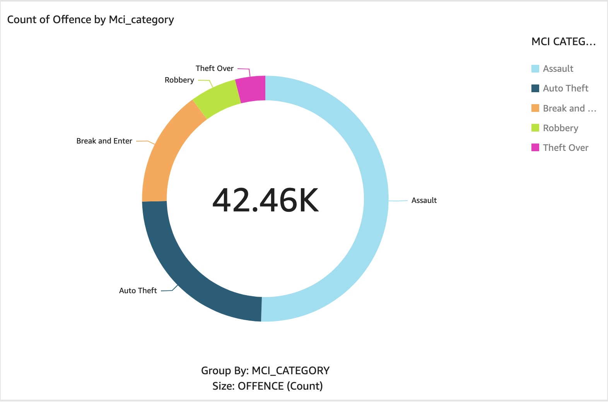
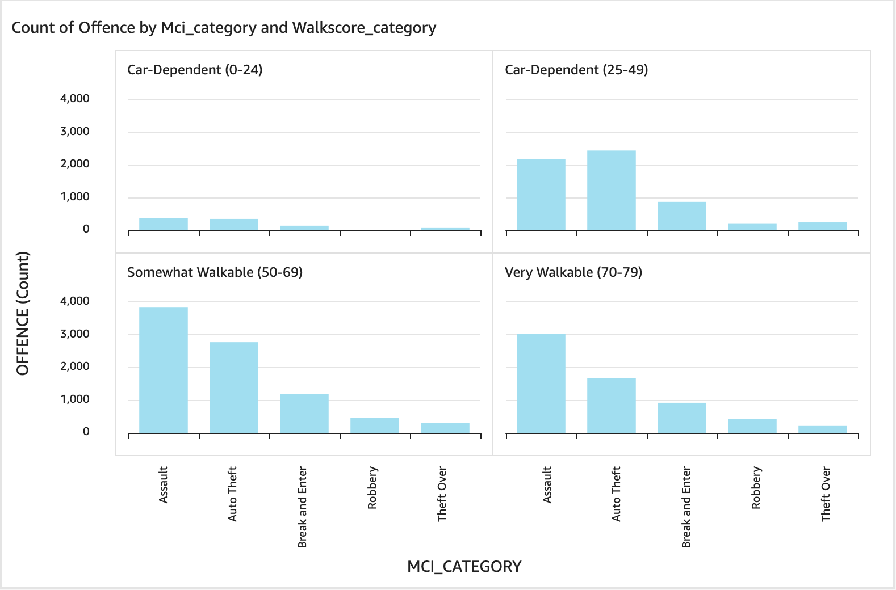
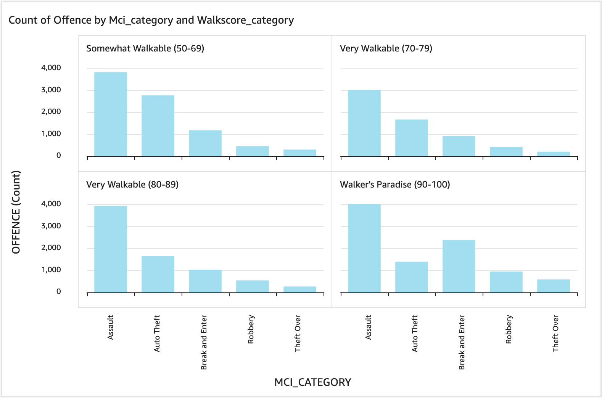
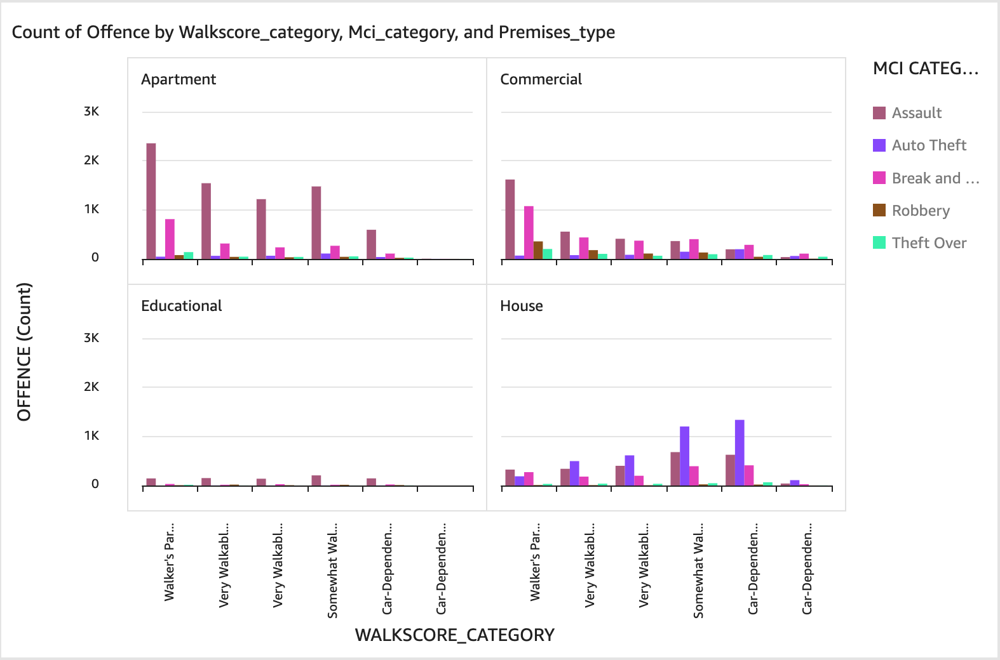
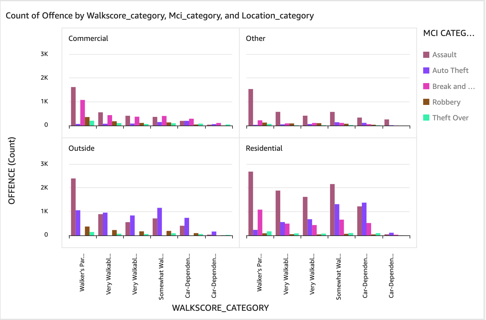
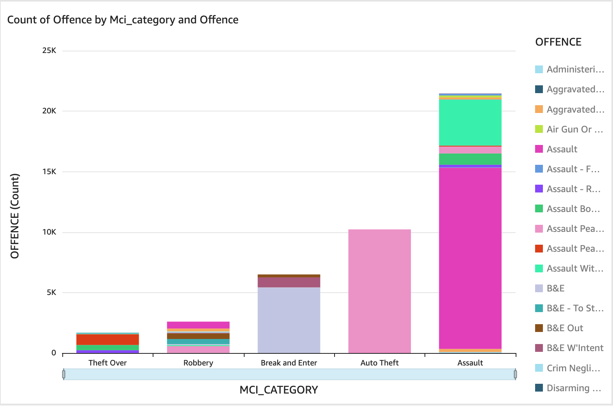
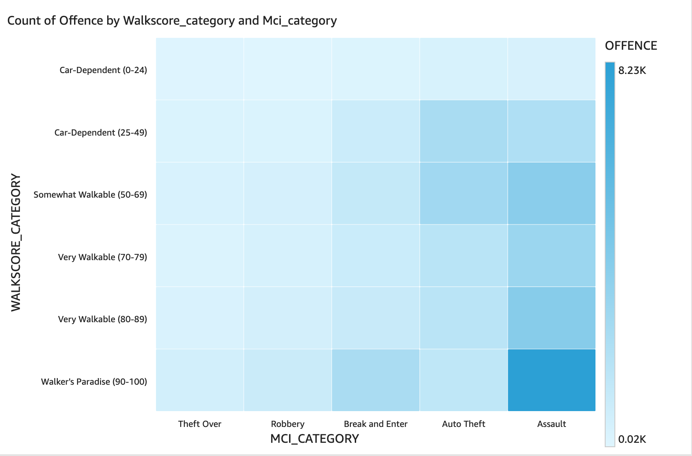

# 🚶‍♂️📊 Exploring the Link Between Walkability and Crime

I’ve always been interested in creating projects that explore how a person can improve their standard of living through simple decisions—without necessarily needing to earn more money. Higher income often leads to a better quality of life, but so can living in a convenient location with easy access to essential amenities and low crime rates.

This led me to ask:

> **Is there a relationship between a neighbourhood’s walkability and crime rates?**

Given the well-established link between poverty and crime—and considering that walkable areas may reduce a person’s costs and increase their access to services (thereby reducing poverty)—I began to wonder:

> **Could walkability reduce crime, or does it lead to more crime due to higher population density?**

---

## 🔬 Hypotheses

- **Assaults** will be higher in walkable / densely populated areas  
- **Thefts** will be more common in less walkable areas due to reduced access to necessities  
- **Break and enters** will be less common in more walkable areas  
- **Robberies** will be higher in walkable / densely populated areas  
- These patterns will likely differ across cities  

---

## 🔍 Data Source

- **Toronto Police Crime Database For 2022**  
  _(Includes coordinates, crime type, occurrence date, neighborhood info, etc.)_

---

## 🧠 Project Approach

1. Retrieved public crime data from the Toronto Police Crime Database, including coordinates, crime categories, neighborhoods, and occurrence dates.  
2. Developed a Python script to calculate a walk score based on the location of each crime.  
3. Computed walk scores for every data point in the dataset.  
4. Built an ETL pipeline using **AWS Glue** to clean and structure the data.  
5. Stored the processed data in an **AWS S3 bucket**.  
6. Queried the data using **AWS Athena**.  
7. Visualized findings with **Amazon QuickSight**.

##💡 Some Key Insights I Found:
1. Assaults are higher in places with higher walk scores, potentially due to higher population density.
2. Auto thefts are more common in more car dependent areas.
3. In apartments, residential, commercial spaces assaults are higher as walk scores go up. But in residential spaces, auto thefts go up as walk scores go down. That is not the case for apartments or commercial spaces.
4. In houses auto thefts go up as walk scores go down, and all occurrences of crime are low in houses, including assaults, this could be because all crime is easier for more people to find and report in places like apartments, residential, commercial spaces. Or living in a house can make you safer by controlling the effects of population density on crime. 
5. Auto thefts are higher outside, and go up slightly the more car dependent a place becomes.
6. Overall assaults are the most common type of crime in Toronto. Toronto has the highest population density in Ontario so the effects of population density could be overrepresented in this analysis.
7. So according to this data the safest place to live is in a house in a place with a high walk score.

#📊 ANOVA Across Crime Categories (MCI_CATEGORY)
 - Purpose: Check if the average walk scores differ significantly between types of crime.
 - F-statistic: 689.64
 - p-value: < 0.001
 - ✅ Interpretation: Strong evidence that different crime types are associated with significantly different walk score distributions — the null hypothesis (that they’re the same) is rejected.

#🔝 Top Correlations (Positive and Negative)
1. Theft Over
Correlation: +0.28 (moderate positive)
P-value: Very low (statistically significant)
Interpretation: "Theft Over" (large thefts) tend to occur more often in areas with higher walkability.
 This makes sense — more foot traffic and densely packed amenities may create more opportunities for theft in places like shopping districts.

2. B&E (Break and Enter)
Correlation: -0.16 (mild negative)
Interpretation: Break-ins are more common in less walkable areas.
 Possibly because less walkable areas contain more standalone houses or quieter areas, making them easier targets with less surveillance.

3. Robbery
Correlation: +0.10 (mild positive)
Interpretation: Robberies may be slightly more likely in walkable areas — again, more interaction and foot traffic might increase opportunities, or make it easier to blend in post-offense.

4. Auto Theft
Correlation: -0.11
Interpretation: Car thefts are more frequent in less walkable areas, possibly because:
People are more car-dependent (more targets).
Fewer witnesses in suburban environments.

5. Assault
Correlation: ~0.00 to +0.02 (very weak)
Interpretation: Assault appears to be evenly distributed across different walkability levels. No strong evidence linking walkability to assault rates.

#🧠 Insight
This supports the idea that:
Walkability may reduce certain crimes (like break-ins and auto thefts),
But increase others (like theft over, robbery), possibly due to population density, anonymity in crowds, and concentration of valuables.

#🏠 Crimes in or Around Houses
 - Crimes near houses: 8,125
 - Total crimes in dataset: 42,460
 - Share of total: ~19.1% of all crimes occurred in or around houses
 So yes, most crimes happen elsewhere — not near houses.

#🚶 Walkability Comparison
 - Average walkscore where crimes happen near houses: 62.29
 - Average walkscore for all other premise types: 77.51
 - T-test p-value: < 0.001
✅ Statistically significant difference
Interpretation:
 Crimes near houses are much more likely to occur in less walkable areas. This means you can significantly reduce the overall chances of a crime occurring against you by living in a house in a place with a high walk score.

